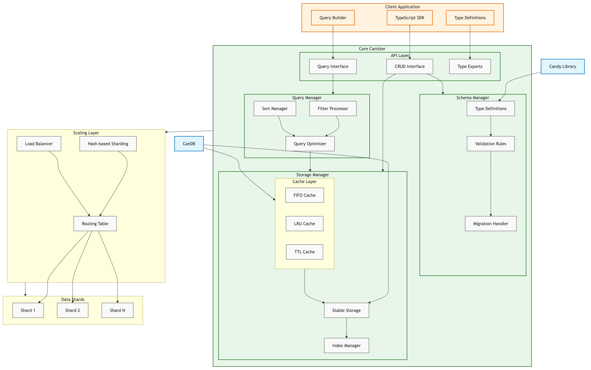

# IC-DataRepository Project Specification

## Core Benefits To Consumers

The reason why we are building this is tied to this user story:

As a data owner and a consumer of that data, I want to be able to simply define
a schema for my data and let the system handle "the rest" so that I can focus on
building my application instead of managing data or managing a database.

- You define a schema.
- You get long term (stable memory) data persistence for "Free".
- You get data management during the canister lifecycle for "Free".
- You get CRUD operations from the system for "Free".
- You get data caching FIFO and TTL handling for "Free".
- You get data caching performance (heap memory) from the system for "Free".
- You get data filtering, sorting, and querying from the system for "Free".
- You get horizontal data scaling for "Free".
- You get a simple to use client side SDK for "Free".

## Overview

IC-DataRepository is a type-safe data repository system for the Internet
Computer that provides schema management, caching, and advanced querying
capabilities. It utilizes stable memory for data persistence and heap memory for
data caching, leveraging the Internet Computer's memory management architecture.

It's similar to a mix of tools like Prisma or STRAPI, but specifically designed
for the Internet Computer's architecture and environment.

It gets it's core capabilities from other projects built on top of the IC.

- [CanDB](https://github.com/ORIGYN-SA/CanDB)
- [Candy](https://github.com/icdevsorg/candy_library)

## Core Features

### Schema Management Layer

This is delegated to CanDB.

- Dynamic schema definition at runtime
- Type generation at build time
- Schema versioning and migration management
- Runtime type validation
- Schema-based data validation
- Export schema types for external consumption
- Build-time type generation for client applications

### Data Store Layer

This is delegated to CanDB.

- Efficient stable memory management
- CRUD operations
- Transaction support
- Data integrity enforcement
- Relationship management
- Backup and restore capabilities
- Memory optimization strategies

### Cache Layer

This is delegated to CanDB.

- In-memory caching of frequently accessed data
- Multiple caching strategies:
  - LRU (Least Recently Used) implementation
  - FIFO (First In, First Out) implementation
  - TTL (Time To Live) support
- Cache invalidation strategies
- Memory usage optimization
- Cache hit/miss statistics
- Cache strategy configuration options

### Query Layer

- Complex filtering capabilities
- Multi-field sorting
- Pagination support
- Query optimization
- Index utilization
- Query statistics and monitoring
- Support for compound queries (AND, OR, NOT)

### Client SDK

- TypeScript type definitions
- Fluent query builder API
- Error handling utilities
- Connection management
- Batch operation support
- Event handling
- Progress monitoring

## Key Differentiators

### Compared to Traditional APIs

1. Type Safety

   - Compile-time type checking
   - Runtime type validation
   - Automatic type generation

2. Data Management

   - Built-in validation
   - Automatic relationship handling
   - Index management
   - Migration support

3. Developer Experience

   - Higher-level abstractions
   - Built-in best practices
   - Reduced boilerplate
   - Consistent patterns

4. IC-Specific Design
   - Stable memory optimization
   - Canister-based architecture
   - IC development patterns
   - No file system dependencies
   - Native horizontal scaling
     - Multi-canister data distribution
     - Cross-canister query optimization
     - Automatic shard management

### Compared to Traditional ORMs

1. IC-Specific Design

   - Stable memory optimization
   - Canister-based architecture
   - IC development patterns
   - No file system dependencies

2. In-Memory Architecture
   - Memory-optimized operations
   - Efficient caching
   - Smart indexing
   - Query optimization

## Technical Architecture

### Scalability Architecture

- Horizontal Scaling
  - Data partitioning across multiple canisters
  - Automatic shard management
  - Cross-canister query optimization
  - Load balancing between shards
  - Consistent hashing for data distribution
  - Configurable replication factors
  - Automatic rebalancing capabilities

### Scaling Data Flow

1. Write Operations

   - Data → Hash Function → Shard Selection → Write to Primary
   - Primary → Replicate to Secondary Shards
   - Consistency Verification

2. Read Operations

   - Query → Shard Selection → Direct Read
   - Cross-Shard Queries → Query Planner → Parallel Execution
   - Result Aggregation

3. Scaling Operations
   - Monitor Shard Sizes
   - Trigger Auto-scaling Based on Thresholds
   - Rebalance Data Across Shards
   - Update Routing Tables

### Component Structure

```
Core Canister
├── Schema Manager
│   ├── Type Definitions
│   ├── Validation Rules
│   └── Migration Handler
├── Storage Manager
│   ├── Stable Storage
│   ├── Cache Layer
│   └── Index Manager
├── Query Manager
│   ├── Filter Processor
│   ├── Sort Manager
│   └── Query Optimizer
└── API Layer
    ├── CRUD Operations
    ├── Query Interface
    └── Type Exports
```

### Data Flow

1. Client Request → Type Validation → Cache Check → Storage Operation → Response
2. Schema Update → Migration Planning → Data Transform → Cache Invalidation
3. Query → Parse → Optimize → Execute → Cache → Respond

## Usage Examples

### Schema Definition

```motoko
let schema = {
  name = "User";
  fields = [
    { name = "id"; type = #Text; key = true };
    { name = "email"; type = #Text; unique = true };
    { name = "name"; type = #Text; indexed = true }
  ];
};
```

### Client Usage

```typescript
const userRepo = createRepository('User')

// Type-safe operations
const users = await userRepo
  .filter({
    role: 'ADMIN',
    posts: { some: { published: true } }
  })
  .sort({ createdAt: 'desc' })
  .take(10)
  .findMany()
```

### Migration Example

```motoko
await repository.migrate({
  from: 1,
  to: 2,
  steps: [
    {
      addField: {
        name: "status",
        type: "Text",
        default: "ACTIVE"
      }
    }
  ]
});
```

## Development Guidelines

### Code Standards

- Clear type definitions
- Comprehensive error handling
- Through documentation
- Test coverage for all features
- Performance optimization
- Security best practices

### Security Considerations

- Input validation
- Access control
- Rate limiting
- Data sanitization
- Error handling
- Audit logging

### Performance Goals

- Efficient memory usage
- Quick query response
- Minimal latency
- Optimized caching
- Smart indexing
- Resource monitoring

## Project Requirements

### Development Tools

- DFX SDK: IC: Replica Environment
- Node.js: Development Environment
- Motoko: Primary Development Language
- mops: Testing Framework
- mops: Dependency Management
- mo-dev: Development Lifecycle
- mo-doc: Documentation Generator

### Testing Requirements

- Unit Tests
- Integration Tests
- Performance Tests
- Type Tests
- Migration Tests
- Security Tests

# System Architecture

Initial system design is based on the following diagram:


